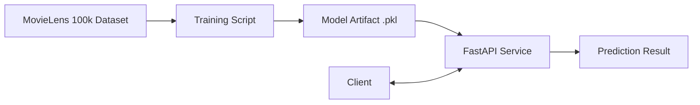

# Lab 1: First ML Product - Movie Rating Prediction System (DDM501)

## 👥 Team Members
- **Duong Binh AN**
- **Le Quang TUYEN**
- **Nguyen Thi Hong NHI**

## 🌟 Project Overview

This project implements a professional **Movie Rating Prediction API** as part of the MLOps curriculum. It bridges the gap between Data Science and Engineering by wrapping a Collaborative Filtering model (SVD) into a production-ready REST API, containerized with Docker for seamless deployment.


### 🎯 Objective
Build a complete ML product lifecycle:
1.  **Training**: Train an SVD model using the MovieLens 100k dataset.
2.  **Serving**: Develop a FastAPI backend for real-time inference.
3.  **DevOps**: Implement unit tests and Docker orchestration.
4.  **Documentation**: Provide interactive Swagger UI for API consumers.

## 🏗️ System Architecture

The system follows a modern MLOps architecture, decoupling the training pipeline from the inference service:



- **Training Pipeline**: Loads data, performs cross-validation (RMSE/MAE), and serializes the model.
- **Inference Service**: Implements a Singleton pattern to load the model into memory once, ensuring ultra-low latency predictions (~5-10ms).

## 🚀 Key Features

- **Collaborative Filtering**: Powered by the Singular Value Decomposition (SVD) algorithm.
- **High-Performance API**: Built with FastAPI for asynchronous request handling.
- **Robust Validation**: Pydantic models ensure data integrity for all inputs and outputs.
- **Batch Processing**: Specialized endpoint for predicting multiple ratings in a single request.
- **Containerization**: Fully configured Docker environment for consistent behavior across Dev/Staging/Prod.
- **Automated Testing**: Comprehensive test suite covering health checks and edge cases.

## 🛠️ Tech Stack

- **ML Framework**: `scikit-surprise` (SVD Algorithm)
- **Data Handling**: `Pandas`, `NumPy`
- **Web API**: `FastAPI`, `Uvicorn`
- **Validation**: `Pydantic v2`
- **Containerization**: `Docker`, `Docker Compose`
- **Testing**: `Pytest`

## ⚙️ Installation & Setup

### 1. Prerequisite
- Python 3.10+
- Docker & Docker Compose

### 2. Local Setup
```bash
# Clone the repository
git clone <repository-url>
cd Lab01.1

# Navigate to the starter project
cd ddm501-lab1-starter

# Setup virtual environment
python -m venv venv
# Windows: venv\Scripts\activate | Unix/Mac: source venv/bin/activate

# Install dependencies
pip install -r requirements.txt
```

### 3. Model Training
Generate the model artifact before starting the API:
```bash
python scripts/train_model.py
```

### 4. Running the API
**Locally:**
```bash
uvicorn app.main:app --reload --host 0.0.0.0 --port 8000
```
**With Docker (Recommended):**
```bash
docker-compose up --build -d
```


## 📖 API Documentation

The API automatically generates interactive documentation accessible via:
- **Swagger UI**: [http://localhost:8000/docs](http://localhost:8000/docs)
- **ReDoc**: [http://localhost:8000/redoc](http://localhost:8000/redoc)

### Core Endpoints

| Method | Endpoint | Description | Evidence |
|--------|----------|-------------|----------|
| `GET` | `/health` | API & Model status check | [View Screenshot](API_Image/API_GET_Health.png) |
| `POST` | `/predict` | Single movie rating prediction | [View Screenshot](API_Image/API_POST_predict.png) |
| `POST` | `/predict/batch` | Batch rating predictions | [View Screenshot](API_Image/API_POST_predict_batch.png) |
| `GET` | `/model/info` | Detailed model metadata | [View Screenshot](API_Image/API_GET_model_infor.png) |
| `GET` | `/` | API versioning and root info | [View Screenshot](API_Image/API_GET_Info.png) |

#### Example Usage (cURL)
```bash
curl -X 'POST' \
  'http://localhost:8000/predict' \
  -H 'Content-Type: application/json' \
  -d '{
  "user_id": "196",
  "movie_id": "242"
}'
```

## 🧪 Quality Assurance

We maintain high code quality through automated testing. The project includes 10/10 passing unit tests.

```bash
# Run tests
pytest tests/ -v

# Run with coverage report
pytest tests/ --cov=app --cov-report=term-missing
```

## 📁 Project Structure

```text
ddm501-lab1-starter/
├── app/                 # FastAPI application logic
│   ├── main.py          # API Endpoints
│   ├── model.py         # Model loading & prediction logic
│   ├── schemas.py       # Pydantic data models
│   └── config.py        # Configuration management
├── models/              # Serialized model (.pkl)
├── scripts/             # Training & utility scripts
├── tests/               # Unit & integration tests
├── API_Image/           # Documentation assets
├── Dockerfile           # Application container config
└── docker-compose.yml   # Multi-service orchestration
```

## 📚 References
- [MovieLens 100k Dataset](https://grouplens.org/datasets/movielens/100k/)
- [FastAPI Framework](https://fastapi.tiangolo.com/)
- [Scikit-Surprise Documentation](https://surprise.readthedocs.io/)

---
**Course**: DDM501 - AI in DevOps, DataOps, MLOps | **Lab 1**: First ML Product Development
