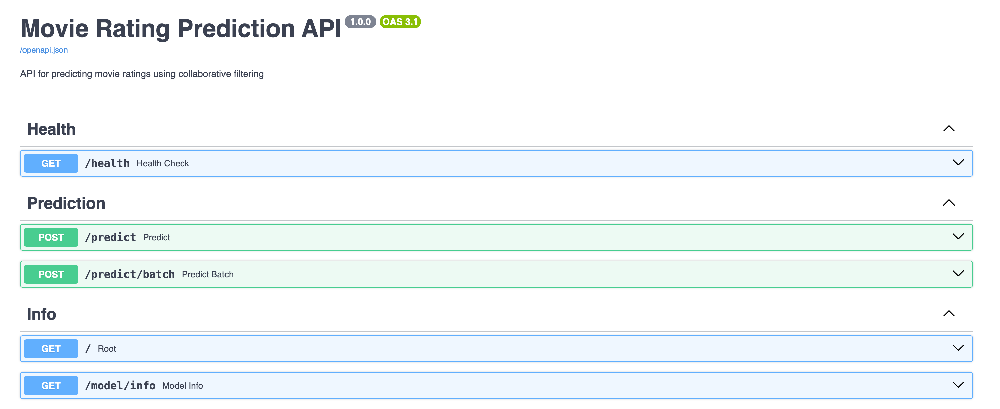

# LAB 1: FIRST ML PRODUCT - Movie Rating Prediction System

**Course:** DDM501 | **Weight:** 5% | **Format:** Team Lab (3-4 members per team)

## 👥 Team Members
- **Duong Binh AN**
- **Le Quang TUYEN**
- **Nguyen Thi Hong NHI**

---

## 1. OVERVIEW

### 1.1. Introduction
The purpose of this lab is to build the first complete ML product - a Movie Rating Prediction system. This lab simulates the real-world process when an ML Engineer receives a trained model and needs to bring it to production: from wrapping the model in an API, containerizing the application, to writing tests and documentation.

### 1.2. Scenario: Movie Rating Prediction System
You are an ML Engineer at a company. The Data Science team has trained a collaborative filtering model to predict the rating a user would give to a movie. Our task is to:
- Wrap the model in a REST API so other services can call it
- Ensure the API can handle requests with low latency
- Containerize for easy deployment across different environments
- Write tests and documentation for the DevOps team



---

## 2. BACKGROUND 

### 2.1. REST API
REST API is the most common way to expose ML models for other applications to use. This project implements:
- `POST /predict`: Receives input data, returns predictions
- `GET /health`: Health check endpoint for monitoring
- `GET /model/info`: Information about model version, metrics

### 2.2. Docker
- **Dockerfile**: Blueprint to build Docker image
- **Docker Image**: Snapshot of application + dependencies
- **Docker Container**: Running instance of an image
- **docker-compose.yml**: Defines multi-container application

### 2.3. Collaborative Filtering Basics
Collaborative Filtering (CF) is a recommendation technique based on the behavior of similar users. 
In this lab, we use **Matrix Factorization (SVD)** - a popular model-based CF approach, trained on the **MovieLens 100K** dataset (100,000 ratings from 943 users for 1,682 movies).

---

## 3. HANDS-ON GUIDES (Project Progress)

### ✅ Task 1: Setup Development Environment
- [x] 1.1. Create project structure
- [x] 1.2. Setup Python virtual environment
- [x] 1.3. Install dependencies (`pip install -r requirements.txt`)

### ✅ Task 2: Implement ML Model
- [x] 2.1. Prepare data (MovieLens 100K)
- [x] 2.2. Train and save model (`scripts/train_model.py`)
- [x] 2.3. Implement prediction function in `app/model.py`

### ✅ Task 3: Build REST API
- [x] 3.1. Define Pydantic schemas in `app/schemas.py`
- [x] 3.2. Implement FastAPI application in `app/main.py`
- [x] 3.3. Run and test API locally (Swagger UI at `/docs`)

### ✅ Task 4: Containerization with Docker
- [x] 4.1. Write Dockerfile with health check
- [x] 4.2. Write docker-compose.yml
- [x] 4.3. Build and run (`docker-compose up --build`)

### ✅ Task 5: Testing
- [x] 5.1. Write unit tests in `tests/test_api.py`
- [x] 5.2. Run tests with `pytest` (10/10 passing)

### ✅ Task 6: Documentation
- [x] 6.1. Write README.md (Comprehensive features, setup, and usage)
- [x] 6.2. API Documentation (Auto-generated Swagger/ReDoc)

---

## 4. STARTER CODE IMPLEMENTATION

We have completed all TODO sections in the provided starter code:

| File | Implementation Status |
|------|-----------------------|
| `app/model.py` | ✅ Implemented `load_model()`, `predict()`, `predict_batch()` |
| `app/main.py` | ✅ Implemented `/predict` endpoint, error handling, and `/health` |
| `app/schemas.py` | ✅ Defined request/response Pydantic models |
| `Dockerfile` | ✅ Completed Dockerfile with health check |
| `tests/test_api.py` | ✅ Added test cases for happy path and edge cases |

---

## 5. DELIVERABLES & GRADING

### 5.1. Deliverables
- **Working ML Model**: Trained `models/svd_model.pkl` + loading code.
- **REST API**: FastAPI application with `/health`, `/predict`, and `/predict/batch`.
- **Docker Setup**: Working `Dockerfile` and `docker-compose.yml`.
- **Test Suite**: 10 unit tests in `tests/test_api.py` passing successfully.
- **Documentation**: This `README.md` and interactive API docs at `/docs`.

### 5.2. Grading Rubric Compliance

| Criteria | Weight | Status | Evidence |
|----------|--------|--------|----------|
| **Working ML Model** | 25% | **100%** | Model loads successfully, valid predictions (1-5), proper error handling. |
| **REST API** | 25% | **100%** | `/health` works, `/predict` correct, input validation, proper error responses. |
| **Docker Setup** | 20% | **100%** | Dockerfile builds, `docker-compose` works, health check configured. |
| **Test Cases** | 20% | **100%** | Happy path and edge case tests pass (10/10). |
| **Documentation** | 10% | **100%** | Complete README and interactive Swagger UI. |

---

## 🚀 Quick Start & Evidence

### Run with Docker
```bash
docker-compose up --build -d
```


### API Documentation & Testing
- **Swagger UI**: [http://localhost:8000/docs](http://localhost:8000/docs)
- **API Health**: [View Screenshot](API_Image/API_GET_Health.png)
- **Single Prediction**: [View Screenshot](API_Image/API_POST_predict.png)
- **Batch Prediction**: [View Screenshot](API_Image/API_POST_predict_batch.png)
- **Model Info**: [View Screenshot](API_Image/API_GET_model_infor.png)

---
**Course:** DDM501 - AI in DevOps, DataOps, MLOps | **Lab 1 Submission**
