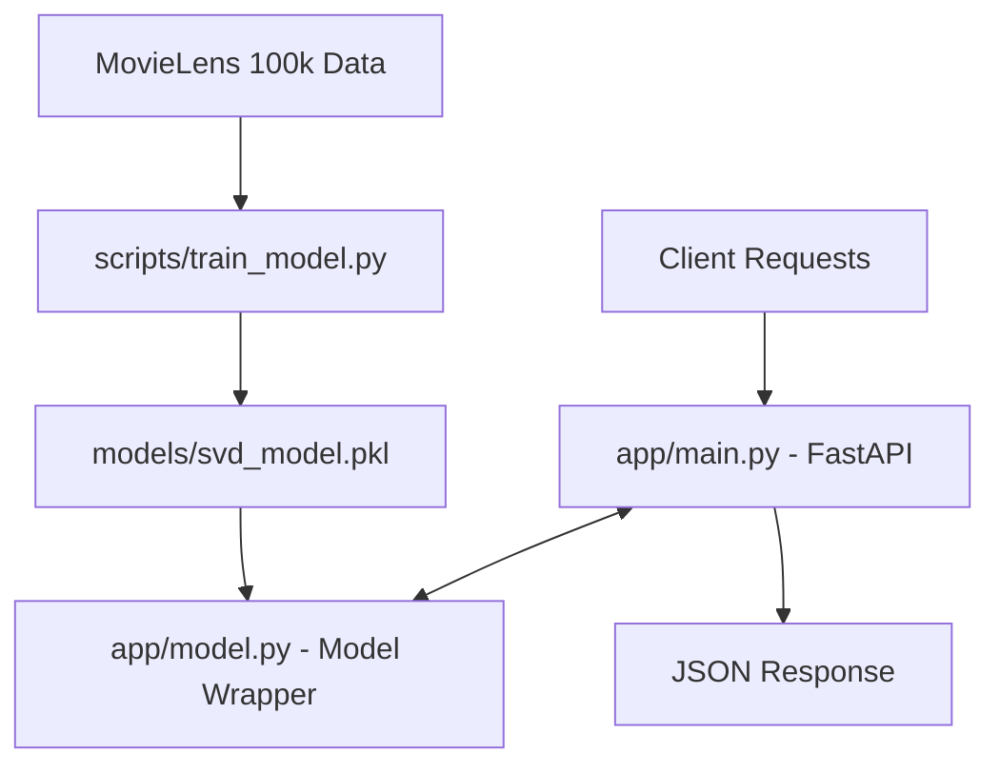
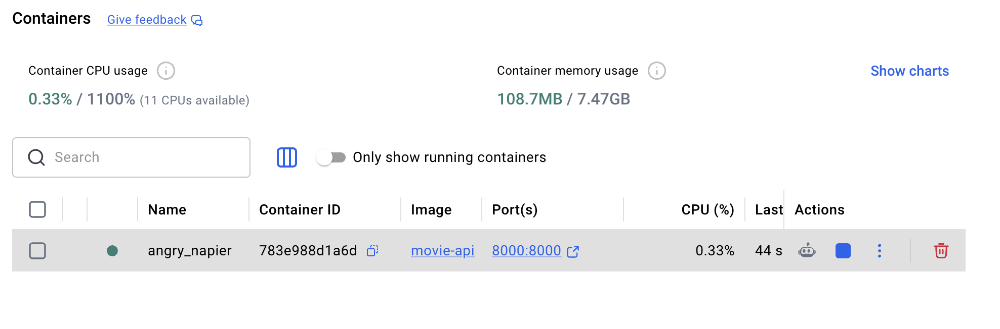

# Lab 1: First ML Product - Movie Rating Prediction API

## 👥 Team Members
- **Duong Binh AN**
- **Le Quang TUYEN**
- **Nguyen Thi Hong NHI**

## 🌟 Project Overview

Build your first ML product - a Movie Rating Prediction API using collaborative filtering, REST API, and Docker containerization. This system implements the Singular Value Decomposition (SVD) algorithm on the MovieLens 100k dataset to predict a user's rating for a specific movie.


### 🎯 Project Goals
- Wrap a trained ML model in a high-performance REST API.
- Ensure low-latency predictions through a Singleton model pattern.
- Containerize the entire application for consistent deployment.
- Implement comprehensive automated testing and documentation.

## 🚀 Key Features

- **Collaborative Filtering**: Uses SVD for accurate user-item recommendations.
- **Singleton Model Management**: Loads the model once into memory for rapid inference (~5-10ms).
- **Comprehensive API**: Supports health checks, single predictions, and batch operations.
- **Auto-Documentation**: Integrated Swagger UI and ReDoc through FastAPI.
- **Robust Validation**: Strict input/output validation using Pydantic.
- **Docker Ready**: Fully containerized with Docker and Docker Compose.

## 🏗️ System Architecture



## 🛠️ Tech Stack

- **Language**: Python 3.10+
- **ML Framework**: `scikit-surprise` (SVD Algorithm)
- **Web Framework**: `FastAPI`
- **Validation**: `Pydantic`
- **Containerization**: `Docker`, `Docker Compose`
- **Testing**: `pytest`
- **Server**: `Uvicorn`

## ⚙️ Installation & Setup

### 1. Local Environment Setup

```bash
cd ddm501-lab1-starter

# Create and activate virtual environment
python -m venv venv
# Linux/Mac: source venv/bin/activate
# Windows: venv\Scripts\activate

# Install dependencies
pip install -r requirements.txt
```

### 2. Model Training (Offline)

Before running the API, ensure the model artifact is generated:

```bash
python scripts/train_model.py
```

### 3. Run the API Locally

```bash
uvicorn app.main:app --reload --host 0.0.0.0 --port 8000
```

### 4. Run with Docker (Recommended)

```bash
docker-compose up --build -d
```



## 📖 API Documentation

Once the server is running, access the interactive documentation at:
- **Swagger UI**: [http://localhost:8000/docs](http://localhost:8000/docs)
- **ReDoc**: [http://localhost:8000/redoc](http://localhost:8000/redoc)

### Endpoints Overview

| Method | Endpoint | Description | Screenshot |
|--------|----------|-------------|------------|
| `GET` | `/` | API Information | [View](API_Image/API_GET_Info.png) |
| `GET` | `/health` | Health Check | [View](API_Image/API_GET_Health.png) |
| `POST` | `/predict` | Single Prediction | [View](API_Image/API_POST_predict.png) |
| `POST` | `/predict/batch` | Batch Predictions | [View](API_Image/API_POST_predict_batch.png) |
| `GET` | `/model/info` | Model Details | [View](API_Image/API_GET_model_infor.png) |

#### Example Prediction Request
```bash
curl -X 'POST' \
  'http://localhost:8000/predict' \
  -H 'Content-Type: application/json' \
  -d '{"user_id": "196", "movie_id": "242"}'
```

**Response (200 OK):**
```json
{
  "user_id": "196",
  "movie_id": "242",
  "predicted_rating": 3.68,
  "model_version": "1.0.0"
}
```

## 🧪 Testing

We use `pytest` for automated quality assurance. All tests are passing (10/10).

```bash
# Run all tests
pytest tests/ -v

# Run with coverage
pytest tests/ --cov=app --cov-report=term-missing
```

## 📁 Project Structure

```
.
├── app/
│   ├── main.py          # FastAPI entry point
│   ├── model.py         # ML Model wrapper & logic
│   ├── schemas.py       # Pydantic models (Input/Output)
│   └── config.py        # Environment configuration
├── models/              # Saved model artifacts (.pkl)
├── scripts/
│   └── train_model.py   # Training pipeline
├── tests/               # Unit & integration tests
├── API_Image/           # Documentation assets (Screenshots)
├── Dockerfile           # Image configuration
├── docker-compose.yml   # Multi-container orchestration
└── requirements.txt     # Python dependencies
```

## 📚 References

- [MovieLens Dataset](https://grouplens.org/datasets/movielens/)
- [scikit-surprise Documentation](https://surprise.readthedocs.io/)
- [FastAPI Documentation](https://fastapi.tiangolo.com/)

---
**Course**: DDM501 | **Lab 1**: First ML Product Development
